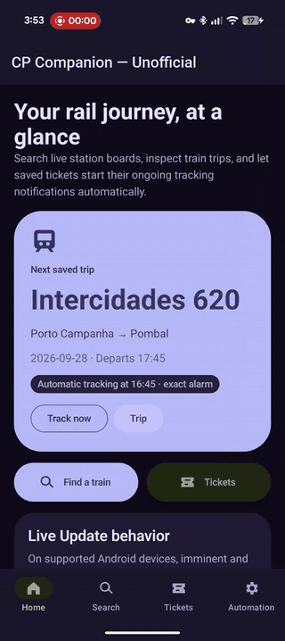
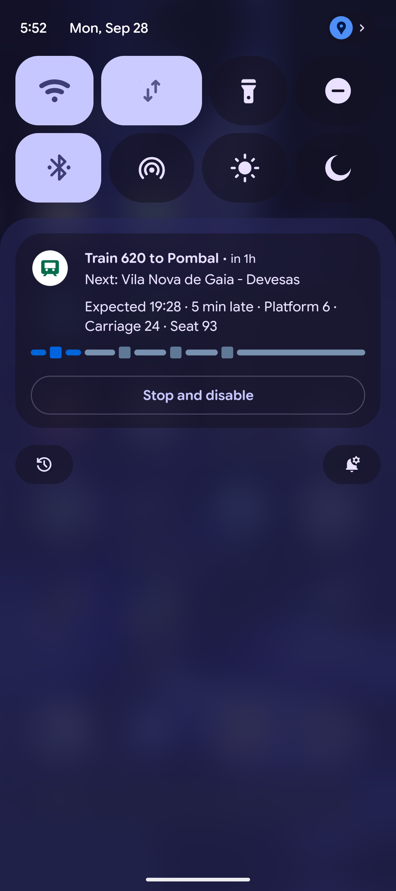
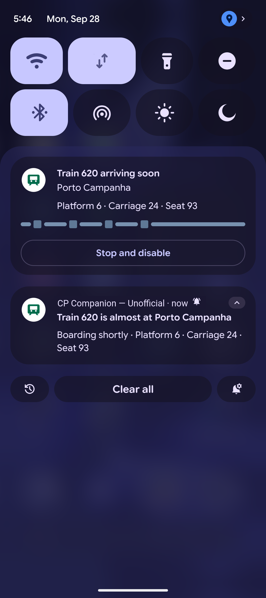
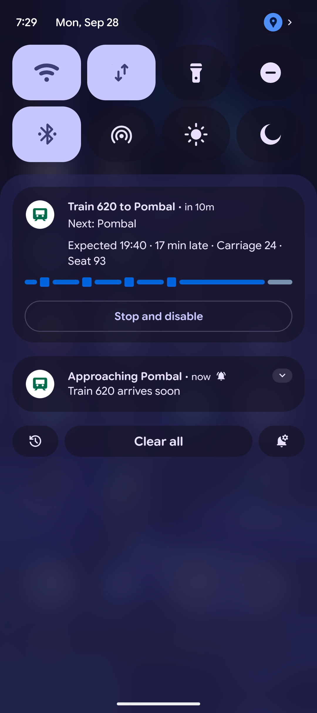
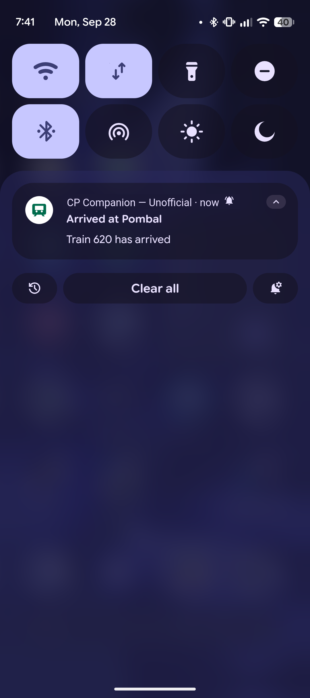
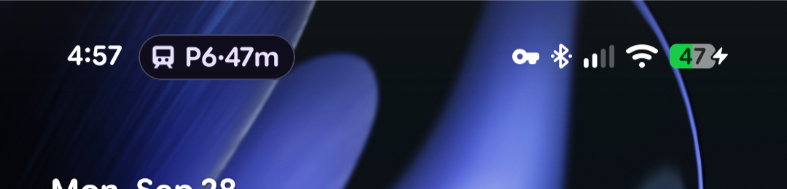
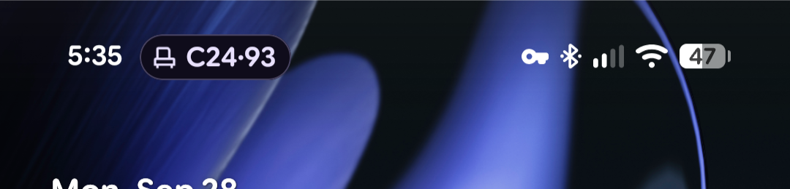
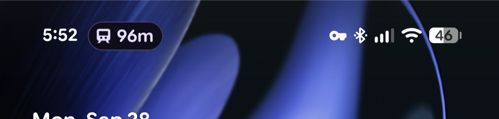

# CP Companion — Unofficial

**Unofficial Android beta for train journeys in Portugal.** View CP station boards and train details, import journey information from tickets, and follow a journey with an ongoing notification.

CP Companion is an independent, unofficial project. It is not affiliated with, endorsed by, sponsored by, authorized by, or otherwise associated with CP — Comboios de Portugal, E.P.E.

“CP”, “Comboios de Portugal”, and any associated names, trademarks, logos, and other distinctive signs belong to their respective rights holders. This project does not claim any rights over them. No CP trademark, branding, data, or other third-party material is relicensed under this project's open-source licence.

Train, station, timetable, and operational information displayed by the application is requested on demand from publicly accessible services made available by CP and used by its public-facing services. These requests are made directly from the user's device to CP; the project maintainer does not operate a proxy or backend that retrieves, stores, aggregates, or redistributes this information. Availability, accuracy, completeness, and continued accessibility of these services are controlled by their respective providers and are not guaranteed by this project.

Imported ticket and journey information is processed locally and is provided only as a convenience. CP Companion does not issue, replace, validate, or modify transport tickets. Users must retain a valid ticket and should consult official CP information where necessary.

If you represent a rights holder and believe that material in this project improperly uses your rights, please contact the maintainer so that the concern can be reviewed.

## Idea

I have ridden CP trains for many years. When the [official Android app](https://play.google.com/store/apps/details?id=pt.cp.mobiapp) became available, I started using it to make my journeys easier. However, for my usage, it had a particular limitation: it did not notify me when a train was delayed, so I had to check for updates myself.

I built CP Companion to follow my train journeys in real time. When SMS import is enabled, the app can import ticket details from CP's ticket messages. About an hour before the scheduled departure, it starts tracking the journey and creates a [Live Update notification](https://developer.android.com/develop/ui/compose/notifications/live-update) showing delays, the departure platform, and the time remaining until departure.

During the journey, the notification continues to show delays and the time remaining until arrival. It also alerts me when it is time to leave the train.

## Features

- Station departures/arrivals, train calling points, and journey status.
- Manual entry, confirmed paste/share import, opt-in SMS inbox import, and optional default-SMS-app notification detection.
- Automatic tracking scheduled one hour before departure for validated future journeys, with recovery after reboot and schedule changes.
- Local encrypted ticket storage, English and Portuguese UI, and light/dark/system themes.
- Lightweight install: under 5 MB on-device, excluding locally stored ticket data imported from SMS messages.

## Screenshots

Ongoing trip progress uses an Android Live Update. Ticket-import confirmations and event alerts, such as boarding and arrival notices, are standard notifications.

<details>
<summary>View the app walkthrough</summary>



[Watch the full 2-minute walkthrough (MP4)](screenshots/app-walkthrough.mp4)

</details>

<details>
<summary>View notifications and status-chip screenshots</summary>

**Notifications**

<table>
  <tr>
    <th>Early trip tracking</th>
    <th>Before boarding</th>
  </tr>
  <tr>
    <td align="center" width="50%">
      <a href="screenshots/live-update-early-journey.png"></a><br>
      <sub>About an hour before arrival, tracking is already active with the next stop and ticket details, before an approaching-station alert.</sub>
    </td>
    <td align="center" width="50%">
      <a href="screenshots/notifications-before-boarding.png"></a><br>
      <sub>Live Update with platform and seat details; a separate standard notification says boarding is near.</sub>
    </td>
  </tr>
  <tr>
    <th>Approaching the destination</th>
    <th>After arrival</th>
  </tr>
  <tr>
    <td align="center" width="50%">
      <a href="screenshots/notifications-approaching-destination.png"></a><br>
      <sub>Live Update with the next-stop countdown and ticket details, alongside a standard approaching-station alert.</sub>
    </td>
    <td align="center" width="50%">
      <a href="screenshots/notification-arrived.png"></a><br>
      <sub>A standard notification confirms the train has arrived.</sub>
    </td>
  </tr>
</table>

**Status-bar chips**

<table>
  <thead>
    <tr>
      <th>Platform and countdown</th>
      <th>Carriage and seat</th>
      <th>Time remaining in trip</th>
    </tr>
  </thead>
  <tbody>
    <tr>
      <td align="center" width="33%">
        <a href="screenshots/status-chip-pre-arrival-platform.png"></a><br>
        <sub>About an hour before arrival: platform and time to arrival.</sub>
      </td>
      <td align="center" width="33%">
        <a href="screenshots/status-chip-pre-arrival-seat.png"></a><br>
        <sub>Five minutes before arrival: carriage and seat numbers.</sub>
      </td>
      <td align="center" width="33%">
        <a href="screenshots/status-chip-in-trip-countdown.png"></a><br>
        <sub>Shown five minutes after the trip starts: time to destination; carriage and seat details remain in the ongoing notification.</sub>
      </td>
    </tr>
  </tbody>
</table>

</details>

## Install

Requires **Android 11 (API 30) or newer**. Check [Releases](https://github.com/oEscal/my-cp-companion/releases) for a signed beta APK. If no release is listed, build from source; CI artifacts are development builds.

### Option 1: Add with Obtainium

<a href="https://apps.obtainium.imranr.dev/redirect?r=obtainium://add/https://github.com/oEscal/my-cp-companion"></a>

### Option 2: Install an APK manually

1. Download `cp-companion.apk` and `SHA256SUMS` from the same release. Compare the APK's SHA-256 with the listed value.
2. Open the APK on Android and allow installation from that browser/file manager when prompted.
3. Grant notifications for visible tracking. SMS inbox, notification access, and exact-alarm access are optional and explained in the Automation tab.

### Android restricted settings

On Android 13 and newer, Android may block notification access as a restricted setting for some installs. If you see a “Restricted setting” warning, open **Settings > Apps > CP Companion > ⋮ > Allow restricted settings**, then return to the Automation tab and enable notification access. Without notification access, automatic detection of CP ticket messages posted by your default SMS app cannot work. Automatic SMS inbox import is separate and requires SMS permission plus explicit opt-in in the Automation tab. See [Google's restricted-settings instructions](https://support.google.com/android/answer/12623953); allow this setting only if you trust the app.

Install future releases over the existing app to preserve journeys. Updates must use the same signing certificate. A debug installation uses a different certificate; uninstalling it to install a release deletes its local data. See [privacy and deletion](PRIVACY.md).

## Build

Use JDK 17 (the version used by CI), Python 3.10+, Android SDK Platform 37, and Build Tools 37.0.0. Initial dependency downloads require network access. Linux, macOS, and Windows are supported by the committed Gradle wrapper.

```bash
git clone https://github.com/oEscal/my-cp-companion.git
cd my-cp-companion
```

Open the project in Android Studio and install the requested SDK components, or use the SDK command-line tools. Set `ANDROID_HOME` to the SDK directory, or copy `local.properties.example` to `local.properties` and set `sdk.dir`. The local file is ignored and is allowed during development.

On Linux/macOS:

```bash
./build.sh
```

The script runs source checks, unit tests, lint, instrumentation APK compilation, debug assembly, release shrinking, and dependency-notice verification. It does not execute device tests without a connected device and the task below. Release output is unsigned unless all four `CP_RELEASE_*` signing variables are configured.

Debug APK: `app/build/outputs/apk/debug/app-debug.apk`.

```bash
./gradlew :app:connectedDebugAndroidTest
```

CI runs instrumentation tests on Android API 30 and 36 emulators. See [validation evidence](docs/VALIDATION.md) for the distinction between automated tests and the remaining real-device journey checks.

## Contribute and get help

Read [CONTRIBUTING.md](CONTRIBUTING.md) for architecture, checks, and dependency updates. Report bugs in [Issues](https://github.com/oEscal/my-cp-companion/issues), including app/device versions and reproduction steps. Use synthetic journeys and redact screenshots; never post real ticket references, SMS text, passenger details, QR codes, or credentials.

## Privacy and attribution

SMS and notification parsing happen locally. Requests for station/train data go directly to CP, which receives the requested train/station/date and connection metadata. Read the [privacy policy](PRIVACY.md); it and third-party notices are also available offline in the Automation tab.

Third-party licenses are preserved separately from the maintainer-selected project license. See [THIRD_PARTY_NOTICES.md](THIRD_PARTY_NOTICES.md). CP names, marks, and upstream data are not relicensed by this repository.

## Note

This app was built entirely through “vibe coding”: I used AI tools to turn a personal need into something useful as quickly as possible. I tested it for several months, and it has worked for me. It is still beta software and may have problems or miss updates. Use it at your own risk; I cannot guarantee that it will work correctly or take responsibility for issues that result from its use.
